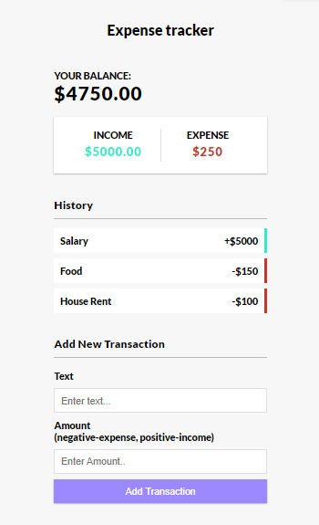

# Expense Tracker

## Description

This Expense Tracker is a simple web application built using JavaScript that allows you to track your expenses locally in your browser. It provides a user-friendly interface to add and manage your income and expenses, helping you keep a close eye on your financial transactions.

## Features

- Add and manage income and expenses
- Real-time balance calculation
- Easy-to-use interface
- Data stored locally in your browser
- No need for external accounts or servers

## Usage

1. Clone or download this repository.
2. Open the `index.html` file in your web browser.
3. Start tracking your expenses and income.

## Local Storage

The app uses local storage to save your financial data, ensuring your privacy and security.

## Contributors

- Your Name

Feel free to contribute to this project and make it even better!

**Note:** This project is intended for educational purposes and may not be suitable for production use.
